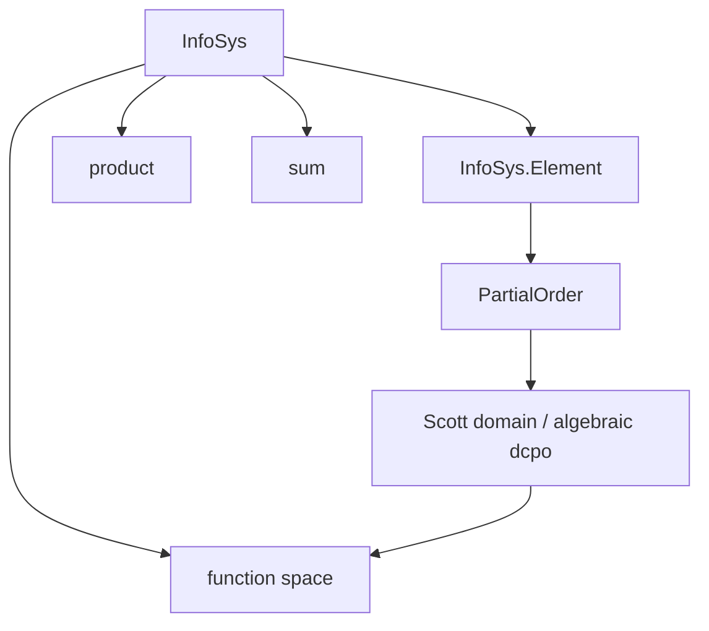

# Scott 1982 Information Systems in Lean 4 (Part III)

---

## Abstract

Lean 4 formalization of Dana Scott's **1982** *Domains for Denotational Semantics* (ICALP) —
information systems (finite consistency + entailment on tokens), developed **constructively**
(`#print axioms ⊆ {propext, Quot.sound}`).

This repository is **Part III** of a four-part monograph. Equivalence theorems live in
[`scott_models`](https://github.com/catskillsresearch/scott_models).

**Inventory source of truth:** this file (`arxiv.md`).

---

## 1. Part III — Scott 1982 information systems (stub)

**Source:** Scott, *Domains for Denotational Semantics*, ICALP 1982, LNCS 140. OCR draft:
`[sources/Domains_for_Denotational_Semantics.md](sources/Domains_for_Denotational_Semantics.md)`.

**Constructivity:** **Fully constructive target.** Every result must satisfy `#print axioms ⊆ {propext, Quot.sound}`. Choice-tainted mathlib `Finset` operations are avoided via
`Scott1982/Constructive.lean` (`funion`, `insert_comm'`, …).

**Lean root:** `Scott1982/InfoSys.lean`, `Scott1982/Constructive.lean`.

### 1.1 In place today

- `InfoSys` structure (Scott Def 2.1, six axioms; `insert` instead of `∪` for (iii)).
- `InfoSys.Element` (ideals) and partial order instance.

### 1.2 Planned content


| Scott (1982)            | Planned Lean                                        | Status      |
| ----------------------- | --------------------------------------------------- | ----------- |
| Prop 2.3                | Scott domain = consistently complete algebraic dcpo | **Not Yet** |
| Def 3.1 / constructions | function space, product, sum + universal properties | **Not Yet** |
| Domain equations        | solutions as IS                                     | **Not Yet** |


### 1.3 Planned dependency (stub)




---

---

## Build

```bash
lake exe cache get
lake build Scott1982
```

## Appendix — Lean source index (Part III)

| File | Role |
| --- | --- |
| `Scott1982.lean` | Root import graph |
| `Scott1982/Constructive.lean` | Choice-free `Finset` prelude |
| `Scott1982/InfoSys.lean` | Scott Def 2.1 + elements (stub) |

Vision transcript: `sources/Domains_for_Denotational_Semantics.md`.

---

## References (Part III)

- **[Sco82]** D. Scott. *Domains for Denotational Semantics*. ICALP 1982, LNCS 140.
- **[Win93]** G. Winskel. *The Formal Semantics of Programming Languages*. MIT Press, 1993.
