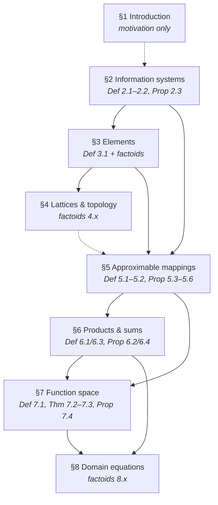
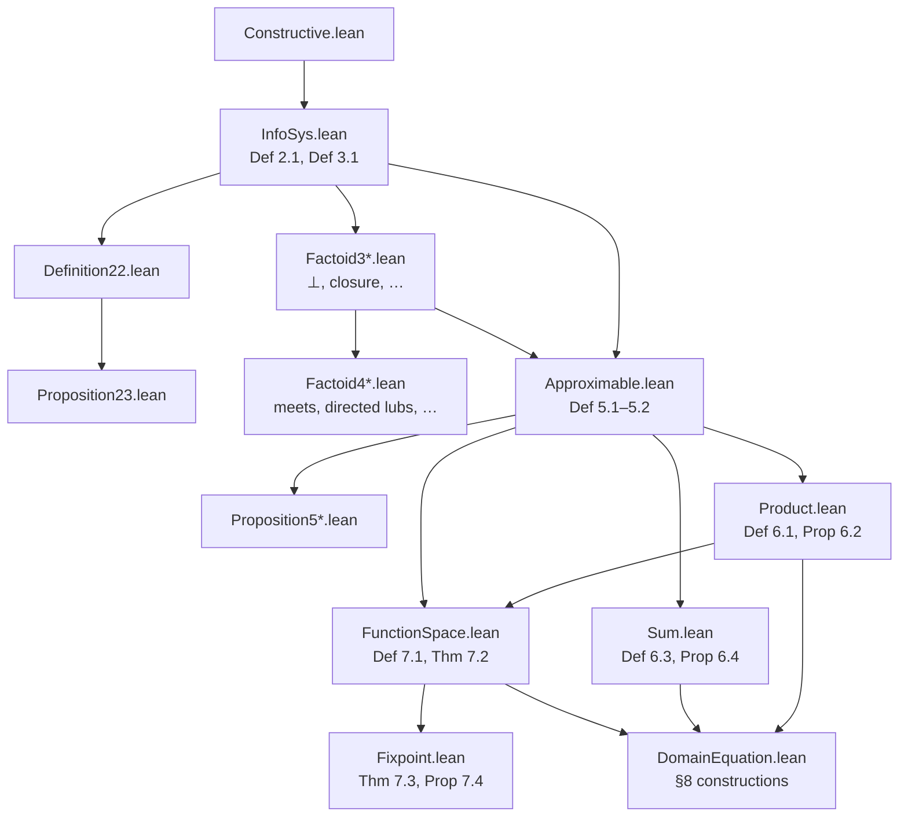
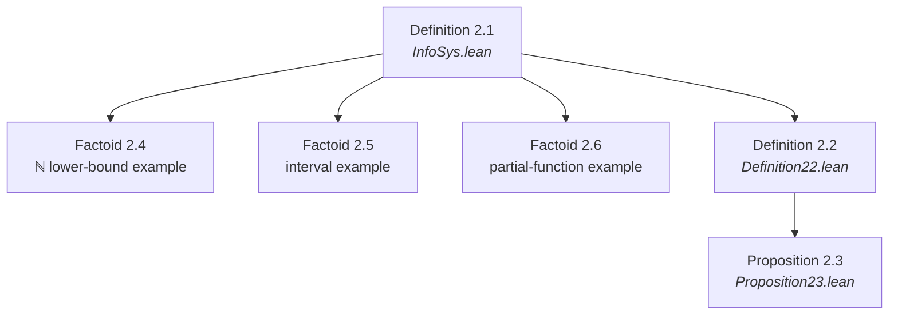
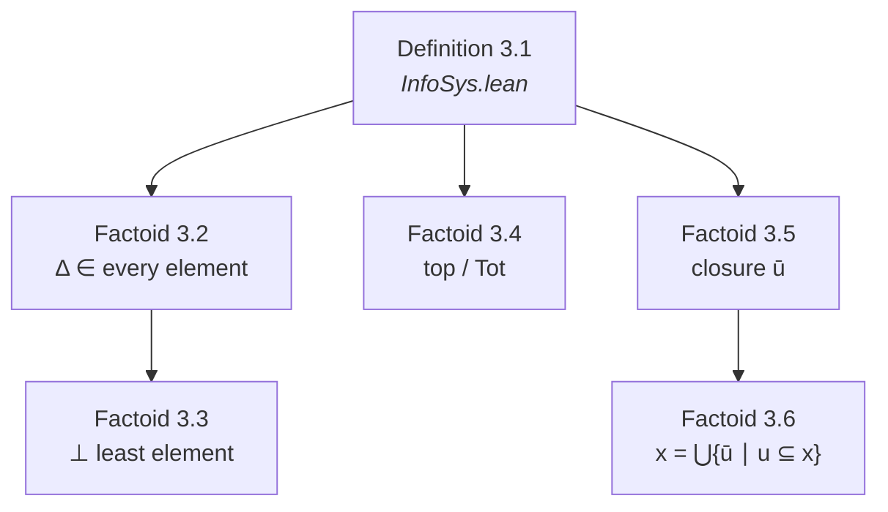
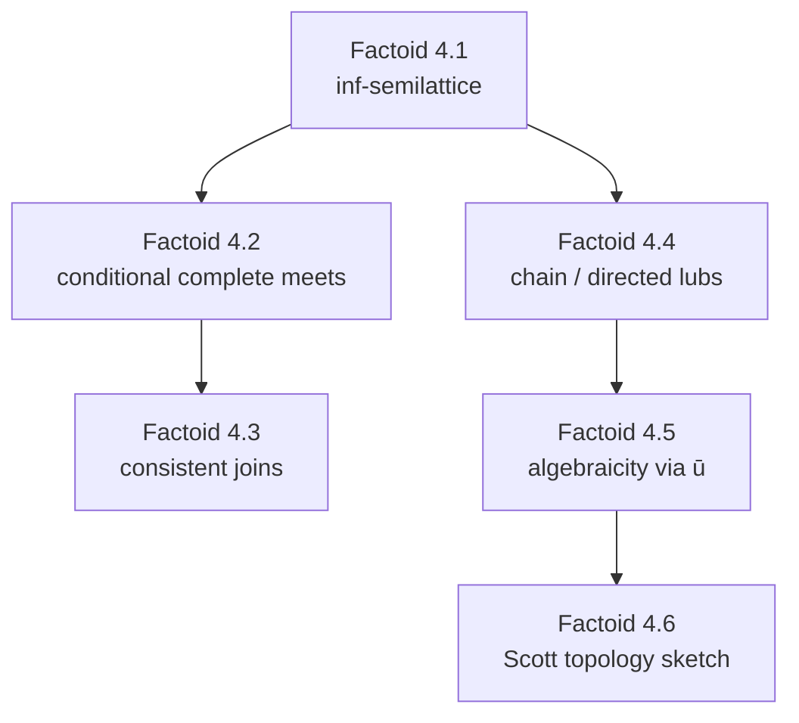
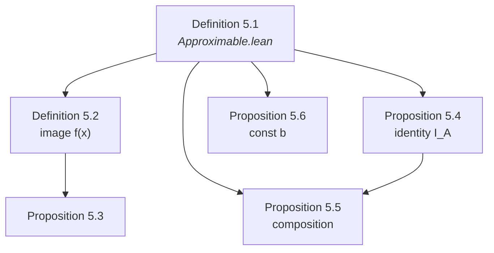
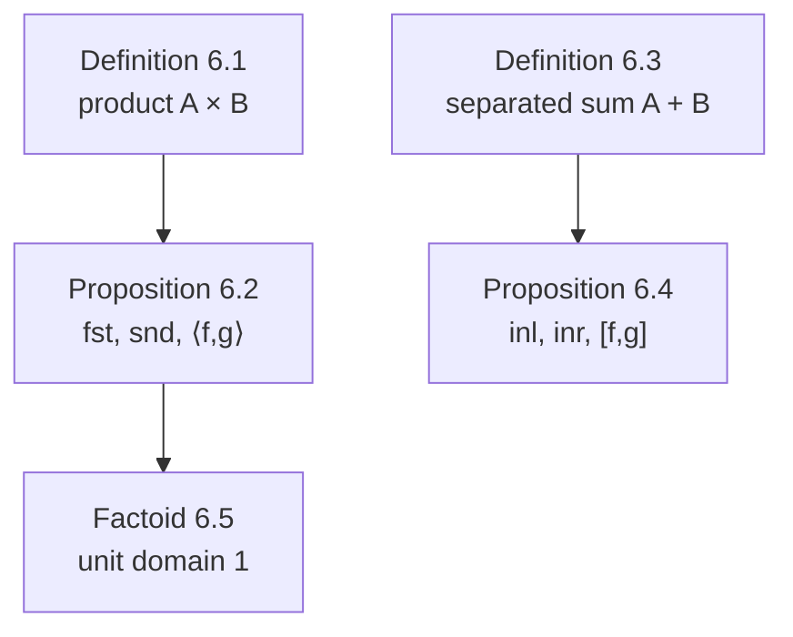
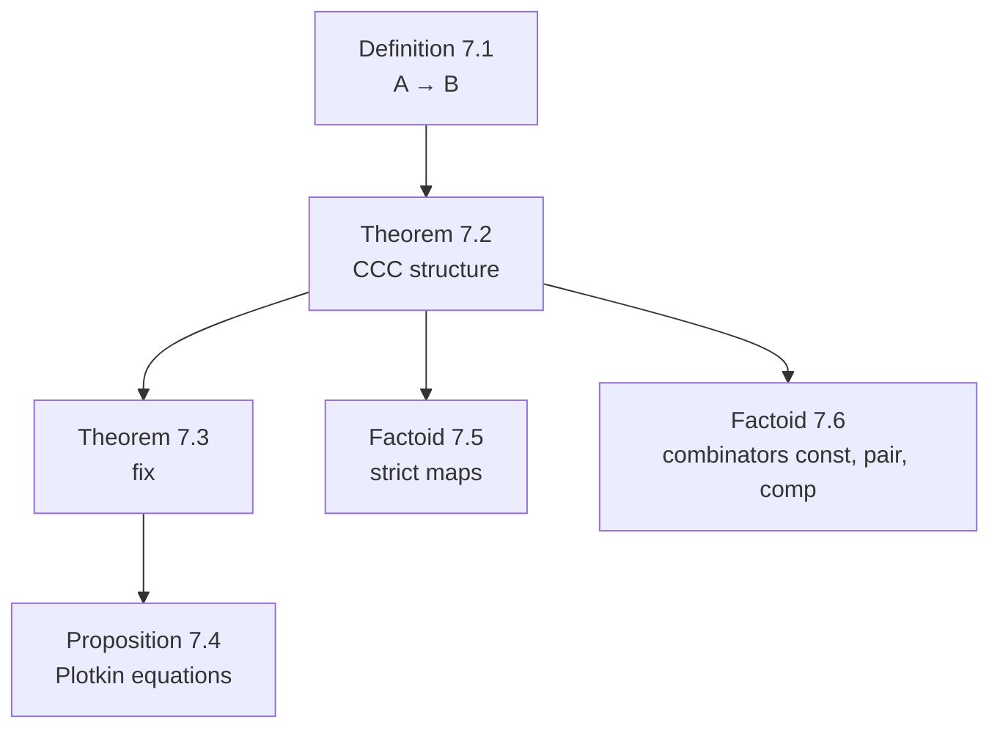
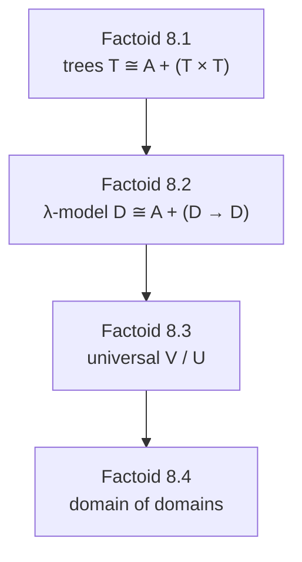

# Formalizing Dana Scott's 1982 Information Systems in Lean 4

---

## Abstract

In 1982 Dana Scott published *Domains for Denotational Semantics* (ICALP, LNCS 140),
presenting domains via **information systems**: finite consistency and entailment on data
objects (tokens), with domain elements recovered as consistent, deductively closed sets.
This is the third of Scott's major presentations of domain theory—after continuous lattices
(1972) and neighbourhood systems (PRG-19, 1981)—and is the most explicitly constructive of
the three.

This Lean 4 formalization targets the **entire paper** (Sections 1–8). We strive to avoid
the law of excluded middle. Every completed module is audited with `#print axioms`; the
target footprint is `#print axioms ⊆ {propext, Quot.sound}`. Choice-tainted mathlib `Finset`
operations are replaced by the prelude in `Scott1982/Constructive.lean`.

**Inventory source of truth:** this file (`arxiv.md`). Status values: **Pass** (mechanized,
builds green, zero `sorry`), **Partial**, **Not Yet**, **Deferred**.

---

## Introduction

Scott's 1982 ICALP paper reorganizes domain theory around four simple ideas:

1. **Data objects** (tokens / propositions) with a distinguished least-informative object `Δ`.
2. **Consistency** (`Con`): which finite sets of tokens can hold of a single element.
3. **Entailment** (`⊢`): which tokens are forced by a consistent set.
4. **Elements** as consistent, deductively closed sets of tokens — the domain `|A|`.

From this substrate he builds approximable mappings (a category), products, separated sums,
function spaces (cartesian closed structure), least fixed points, and recursive domain
equations (trees / S-expressions, λ-calculus models, universal domains).

### Paper section dependency (provisional)

Edges follow Scott's narrative dependencies in the paper. **This diagram will be revised**
once the Lean import graph is stable — we do not yet know the true mechanization dependencies.



### Planned Lean module map (provisional)

Named concepts get section-style modules; unnamed numbered results get `DefinitionXY` /
`PropositionXY` / `TheoremXY` files; invented claims use **Factoid** labels.



---

## Methodology

### Source material

Primary source: Dana Scott, *Domains for Denotational Semantics*, ICALP 1982, LNCS 140.
Working OCR: [`sources/Domains_for_Denotational_Semantics.md`](sources/Domains_for_Denotational_Semantics.md)
(`extraction_method: cursor-vision-triple-merge`).

### Numbering

* **Scott's numbers** are used wherever present (Def/Prop/Thm share one counter per section).
* **Invented claims** (informal remarks we elevate to formal statements) use **Factoid** labels
  continuing the section counter, e.g. after Def 3.1 the next invented item is Factoid 3.2.
* Factoids are first-class inventory rows with Lean files and proof notes.

### Constructivity

Target: `#print axioms ⊆ {propext, Quot.sound}`.
`Scott1982/Constructive.lean` supplies choice-free `funion` (`∪'`) and `insert_comm'`.
Avoid mathlib `(· ∪ ·)`, `Finset.image`, `tauto`, `aesop` unless audited.

### Portable prior work

Where Scott 1972 / PRG-19 (scott1980) developed the *same* mathematics in a portable form,
we **copy** the Lean into this repo (adapted to `InfoSys` / `Finset` as needed) rather than
depending on sibling packages. Cross-presentation equivalence theorems remain in `scott_models`.

### Status vocabulary

| Status | Meaning |
|--------|---------|
| **Pass** | Mechanized, `lake build` green, zero `sorry` |
| **Partial** | Core done; documented gaps remain |
| **Not Yet** | Inventory row present; Lean not started |
| **Deferred** | Explicitly out of scope for now (with reason) |

---

## Chronological Formalization Narrative

### §1 Introduction

Motivational prose only — no numbered mathematical claims. No Lean modules.


---

### §2 Information systems



#### Definition 2.1
* **Mathematical Target:** Information system `(D, Δ, Con, ⊢)` with Scott's six axioms (i)–(vi).
* **Lean File:** `Scott1982/InfoSys.lean` (`structure InfoSys`)
* **Proof Notes:** **Pass** — structure fields `con_subset`, `con_sing`, `ent_con`, `ent_bot`,
  `ent_refl`, `ent_trans`. Uses `insert` (not mathlib `∪`) in `ent_con` for choice-freedom.
  Footprint target `{propext, Quot.sound}`.

#### Definition 2.2
* **Mathematical Target:** For `u, v ∈ Con`, write `u ⊢ v` to mean `u ⊢ X` for all `X ∈ v`.
* **Lean File:** `Scott1982/Definition22.lean`
* **Proof Notes:** **Pass** — `InfoSys.EntSet`.

#### Proposition 2.3
* **Mathematical Target:** For `u, v, w, u', v' ∈ Con`: (i) `∅ ⊢ {Δ}`; (ii) `u ⊢ v ⇒ u ∪ v ∈ Con`;
  (iii) `u ⊢ u`; (iv) transitivity; (v) monotonicity; (vi) `u ⊢ v ∧ u ⊢ v' ⇒ u ⊢ v ∪ v'`.
* **Lean File:** `Scott1982/Proposition23.lean`
* **Proof Notes:** **Pass** — uses `∪'` from `Constructive.lean` for (ii) and (vi).

#### Factoid 2.4
* **Mathematical Target:** First example: `D = ℕ`, `Δ = 0`, all finite sets consistent,
  `{nᵢ} ⊢ m` iff `m = 0 ∨ ∃ i, m ≤ nᵢ`.
* **Lean File:** `Scott1982/Factoid24.lean`
* **Proof Notes:** **Pass** — `example : InfoSys ℕ` with `lowerBoundEnt`; axioms (i)–(iii)
  trivial (`Con = univ`); (iv) `0`-bot; (v) reflexivity via `le_rfl`; (vi) cut by chaining
  `≤` through the witness in `u`. Imports only `InfoSys` (Def 2.1 apparatus). No `sorry`.

#### Factoid 2.5
* **Mathematical Target:** Second example: open intervals `(n, m)` with `n < m`, plus `(0, ∞)`.
* **Lean File:** `Scott1982/Factoid25.lean`
* **Proof Notes:** **Not Yet**

#### Factoid 2.6
* **Mathematical Target:** Third example: partial functions `A ⇀ B` as graphs plus `Δ`.
* **Lean File:** `Scott1982/Factoid26.lean`
* **Proof Notes:** **Not Yet**

---

### §3 The elements of a system



#### Definition 3.1
* **Mathematical Target:** Elements `|A|`: subsets `x ⊆ D` with (i) every finite subset in `Con`,
  (ii) closed under entailment. Total elements `Tot_A`.
* **Lean File:** `Scott1982/InfoSys.lean` (`InfoSys.Element`, `PartialOrder`)
* **Proof Notes:** **Pass** (core). `Tot` predicate still **Partial** — see Factoid 3.4.

#### Factoid 3.2
* **Mathematical Target:** Every element contains `Δ`.
* **Lean File:** `Scott1982/Factoid32.lean`
* **Proof Notes:** **Pass**

#### Factoid 3.3
* **Mathematical Target:** `⊥_A = {X ∣ {Δ} ⊢ X}` is the least element.
* **Lean File:** `Scott1982/Factoid33.lean`
* **Proof Notes:** **Pass**

#### Factoid 3.4
* **Mathematical Target:** Top `⊤ = D` exists iff all finite subsets are consistent; then unique total.
* **Lean File:** `Scott1982/Factoid34.lean`
* **Proof Notes:** **Not Yet**

#### Factoid 3.5
* **Mathematical Target:** Closure `ū = {X ∣ u ⊢ X}` of `u ∈ Con` is an element (finite element).
* **Lean File:** `Scott1982/Factoid35.lean`
* **Proof Notes:** **Pass**

#### Factoid 3.6
* **Mathematical Target:** Every element is the directed union of its finite approximations:
  `x = ⋃{ū ∣ u ⊆ x, u ∈ Con}`.
* **Lean File:** `Scott1982/Factoid36.lean`
* **Proof Notes:** **Not Yet**

---

### §4 Domains as lattices and as topological spaces

Informal section; elevated claims are Factoids. Lean dependencies provisional.



#### Factoid 4.1
* **Mathematical Target:** `|A|` is an inf-semilattice under `∩`; `x ⊆ y ↔ x ∩ y = x`.
* **Lean File:** `Scott1982/Factoid41.lean`
* **Proof Notes:** **Not Yet**

#### Factoid 4.2
* **Mathematical Target:** Nonempty families of elements have set-theoretic intersections that are elements.
* **Lean File:** `Scott1982/Factoid42.lean`
* **Proof Notes:** **Not Yet**

#### Factoid 4.3
* **Mathematical Target:** Join of a family exists in `|A|` iff the union is consistent; then join = deductive closure of the union.
* **Lean File:** `Scott1982/Factoid43.lean`
* **Proof Notes:** **Not Yet**

#### Factoid 4.4
* **Mathematical Target:** Directed (in particular chain) unions of elements are elements (cpo).
* **Lean File:** `Scott1982/Factoid44.lean`
* **Proof Notes:** **Not Yet**

#### Factoid 4.5
* **Mathematical Target:** Finite elements `ū` are compact; every element is directed lub of finite elements below it (algebraicity).
* **Lean File:** `Scott1982/Factoid45.lean`
* **Proof Notes:** **Not Yet**

#### Factoid 4.6
* **Mathematical Target:** Scott topology via basic opens `{x ∣ X ∈ x}`; approximable maps = continuous maps (statement-level bridge).
* **Lean File:** `Scott1982/Factoid46.lean`
* **Proof Notes:** **Not Yet** — full topology may borrow patterns from continuous-lattice work copied into this repo if needed.

---

### §5 Approximable mappings between domains



#### Definition 5.1
* **Mathematical Target:** Approximable mapping `f : A → B` as relation on `Con_A × Con_B` with
  (i) `∅ f ∅`; (ii) `u f v ∧ u f v' ⇒ u f (v ∪ v')`; (iii) `u' ⊢ u`, `u f v`, `v ⊢ v' ⇒ u' f v'`.
* **Lean File:** `Scott1982/Approximable.lean`
* **Proof Notes:** **Pass** (structure). Adapted from PRG-19 `ApproximableMap` pattern, rewritten for `Finset`/`Con`.

#### Definition 5.2
* **Mathematical Target:** `f(x) = {Y ∣ ∃ u ⊆ x, u f {Y}}`.
* **Lean File:** `Scott1982/Approximable.lean`
* **Proof Notes:** **Pass** — `toElement`; `exists_rel_of_subset_image`; `toElement_mono` (5.3(iv)).

#### Proposition 5.3
* **Mathematical Target:** (i) `f(x)` is an element; (ii) extensionality via elements; (iii) pointwise order;
  (iv) monotonicity; (v) `u f v ↔ v̄ ⊆ f(ū)`.
* **Lean File:** `Scott1982/Approximable.lean` (partial) / `Proposition53.lean`
* **Proof Notes:** **Partial** — (i) and (iv) via `toElement` / `toElement_mono`. (ii)(iii)(v) **Not Yet**.

#### Proposition 5.4
* **Mathematical Target:** Identity `I_A` given by `u I v ↔ u ⊢ v`; `I(x) = x`.
* **Lean File:** `Scott1982/Proposition54.lean`
* **Proof Notes:** **Pass**

#### Proposition 5.5
* **Mathematical Target:** Composition `g ∘ f`; `(g ∘ f)(x) = g(f(x))`.
* **Lean File:** `Scott1982/Proposition55.lean`
* **Proof Notes:** **Pass**

#### Proposition 5.6
* **Mathematical Target:** Unique constant map `const b` with `(const b)(x) = b`.
* **Lean File:** `Scott1982/Proposition56.lean`
* **Proof Notes:** **Not Yet**

---

### §6 Products and sums of domains



#### Definition 6.1
* **Mathematical Target:** Product information system `A × B` on tagged tokens.
* **Lean File:** `Scott1982/Product.lean`
* **Proof Notes:** **Not Yet**

#### Proposition 6.2
* **Mathematical Target:** `A × B` is an information system; `fst`, `snd`, pairing `⟨f,g⟩` with universal property.
* **Lean File:** `Scott1982/Product.lean` / `Proposition62.lean`
* **Proof Notes:** **Not Yet**

#### Definition 6.3
* **Mathematical Target:** Separated sum `A + B`.
* **Lean File:** `Scott1982/Sum.lean`
* **Proof Notes:** **Not Yet**

#### Proposition 6.4
* **Mathematical Target:** Sum is an information system; injections and copairing.
* **Lean File:** `Scott1982/Sum.lean` / `Proposition64.lean`
* **Proof Notes:** **Not Yet**

#### Factoid 6.5
* **Mathematical Target:** Unit domain `1` with unique element `⊥`; terminal/initial mapping facts Scott records at end of §6.
* **Lean File:** `Scott1982/Factoid65.lean`
* **Proof Notes:** **Not Yet**

---

### §7 The function space as a domain



#### Definition 7.1
* **Mathematical Target:** Function-space information system `A → B` with Scott's `Con`/`⊢` on pairs of consistent sets.
* **Lean File:** `Scott1982/FunctionSpace.lean`
* **Proof Notes:** **Not Yet**

#### Theorem 7.2
* **Mathematical Target:** `A → B` is an InfoSys; elements = approximable maps; `apply` and `curry` (CCC).
* **Lean File:** `Scott1982/Theorem72.lean`
* **Proof Notes:** **Not Yet**

#### Theorem 7.3
* **Mathematical Target:** Least fixed-point operator `fix : (A → A) → A`.
* **Lean File:** `Scott1982/Fixpoint.lean` / `Theorem73.lean`
* **Proof Notes:** **Not Yet** — adapt PRG-19 `fixMap` / `iterMap` patterns (copied/adapted into this repo).

#### Proposition 7.4
* **Mathematical Target:** Plotkin-style equational characterization of `fix`.
* **Lean File:** `Scott1982/Proposition74.lean`
* **Proof Notes:** **Not Yet**

#### Factoid 7.5
* **Mathematical Target:** Strict function space `A →ₛ B` and `strict` operator; `A × A ≅ (BOOL →ₛ A)`.
* **Lean File:** `Scott1982/Factoid75.lean`
* **Proof Notes:** **Not Yet**

#### Factoid 7.6
* **Mathematical Target:** Combinators `const`, `pair`, `comp` as approximable operators.
* **Lean File:** `Scott1982/Factoid76.lean`
* **Proof Notes:** **Not Yet**

---

### §8 Some domain equations



#### Factoid 8.1
* **Mathematical Target:** Inductive construction of tree / S-expression domain `T ≅ A + (T × T)`.
* **Lean File:** `Scott1982/DomainEquation.lean` / `Factoid81.lean`
* **Proof Notes:** **Not Yet**

#### Factoid 8.2
* **Mathematical Target:** λ-calculus model `D ≅ A + (D → D)` via mutual recursion of `D` and `Con`.
* **Lean File:** `Scott1982/Factoid82.lean`
* **Proof Notes:** **Not Yet**

#### Factoid 8.3
* **Mathematical Target:** Universal domain remarks (`V`, retract `U`).
* **Lean File:** `Scott1982/Factoid83.lean`
* **Proof Notes:** **Not Yet**

#### Factoid 8.4
* **Mathematical Target:** Domain of domains via approximable maps on `P` satisfying (1)–(5).
* **Lean File:** `Scott1982/Factoid84.lean`
* **Proof Notes:** **Not Yet**

---

## Build

```bash
lake exe cache get
lake build Scott1982
```

Pinned: Lean / mathlib **v4.30.0**.

---

## Acknowledgments

- **Dana Scott** — *Domains for Denotational Semantics* **[Sco82]**, the paper this development
  formalizes.

### AI-assisted development

The human author retains sole responsibility for the mathematical content, the choice of
formalization route, and every formal claim in this work. Following standard publisher practice
(e.g., COPE guidance on authorship and AI tools **[COPE24]**), **no large language model is listed
as a co-author** — authorship implies an accountability that automated systems cannot bear.

Because this development may borrow Lean and proof patterns from the sibling formalizations
`scott1972` and `scott1980`, **every model in the registry is treated as used** for
acknowledgement purposes. We gratefully acknowledge assistance from the following tools
(auto-generated from `scripts/ai_model_cards.py` when building `arxiv.tex`):

<!-- AI_MODEL_TOOL_BULLETS -->
<!-- /AI_MODEL_TOOL_BULLETS -->

All definitions, constructivity audits, and final prose were reviewed by the human author, who takes
full responsibility for them.

### Artifact availability

The development is at
[`github.com/catskillsresearch/scott1982`](https://github.com/catskillsresearch/scott1982).
Run `lake build Scott1982` for the formalization; `scripts/generate_arxiv_with_code.sh`
builds `arxiv_with_code.md` from this file plus the Lean source.

---

## Appendix — Lean source index

| File | Role |
| --- | --- |
| `Scott1982.lean` | Root import graph |
| `Scott1982/Constructive.lean` | Choice-free `Finset` prelude |
| `Scott1982/InfoSys.lean` | Def 2.1 + Def 3.1 (`Element`) |
| `Scott1982/Definition22.lean` | Def 2.2 `EntSet` |
| `Scott1982/Proposition23.lean` | Prop 2.3 |
| `Scott1982/Factoid24.lean` | Factoid 2.4 ℕ lower-bound example |
| `Scott1982/Factoid32.lean` | Δ ∈ every element |
| `Scott1982/Factoid33.lean` | ⊥ least |
| `Scott1982/Factoid35.lean` | finite closure `ū` |
| `Scott1982/Approximable.lean` | Def 5.1–5.2 |
| `Scott1982/Proposition54.lean` | identity map |
| `Scott1982/Proposition55.lean` | composition |
| *(further files as inventory lands)* | |

Vision transcript: `sources/Domains_for_Denotational_Semantics.md`.

---

## References

- **[Sco82]** D. Scott. *Domains for Denotational Semantics*. ICALP 1982, LNCS 140, pp. 577–613.
- **[Sco81]** D. Scott. *Lectures on a Mathematical Theory of Computation*. PRG-19, Oxford, 1981.
- **[Sco72]** D. Scott. *Continuous Lattices*. LNM 274, 1972.
- **[Win93]** G. Winskel. *The Formal Semantics of Programming Languages*. MIT Press, 1993.
- **[COPE24]** Committee on Publication Ethics (COPE). *Authorship and AI tools: COPE position statement*. 2024. <https://publicationethics.org/guidance/cope-position/authorship-and-ai-tools>
<!-- AI_MODEL_REFERENCES -->
<!-- /AI_MODEL_REFERENCES -->
