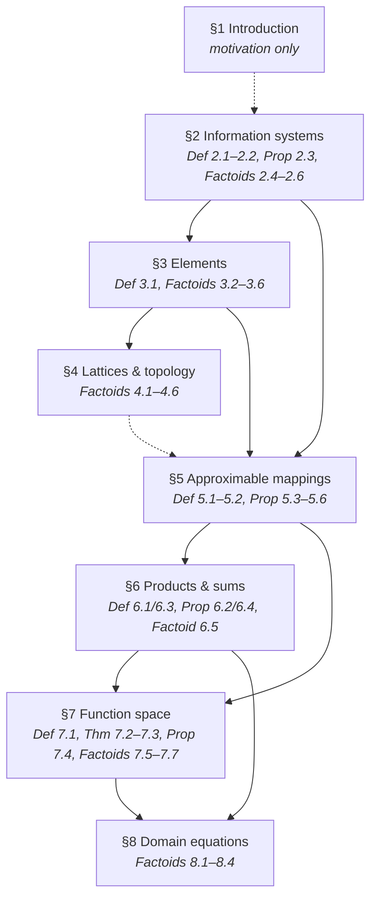
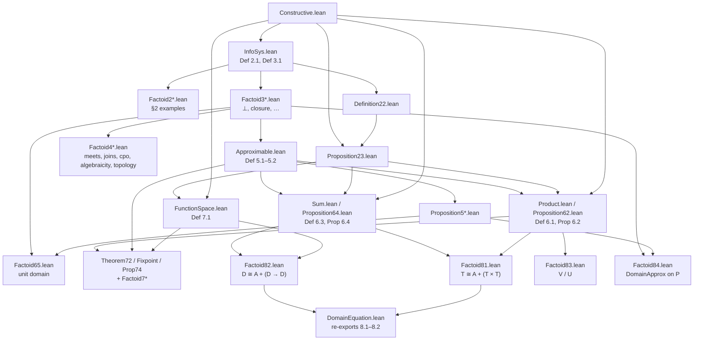
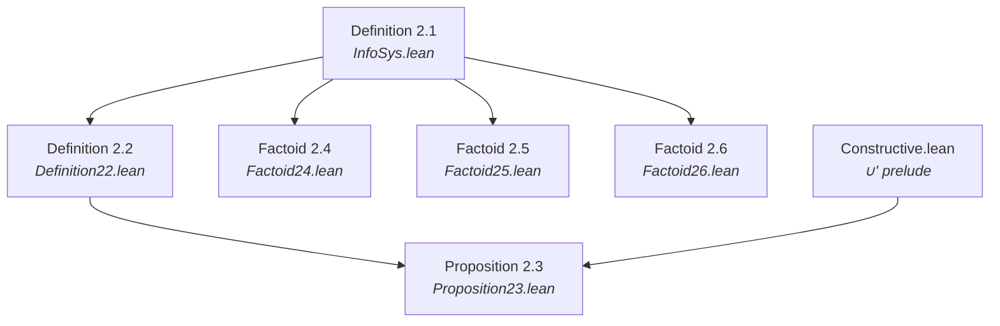
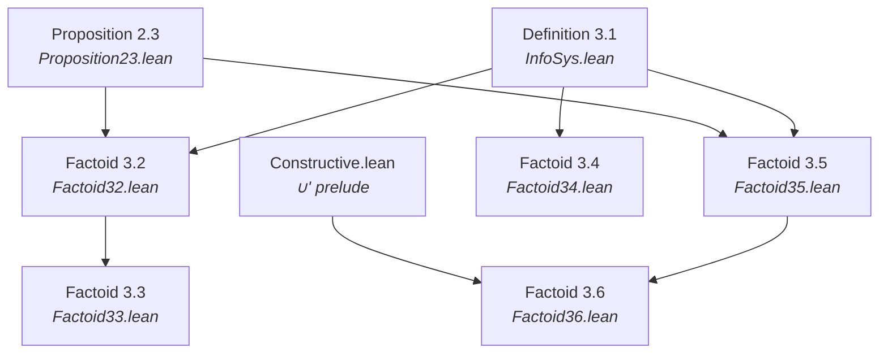
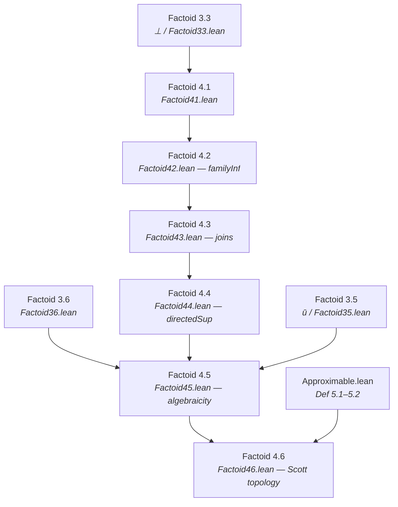
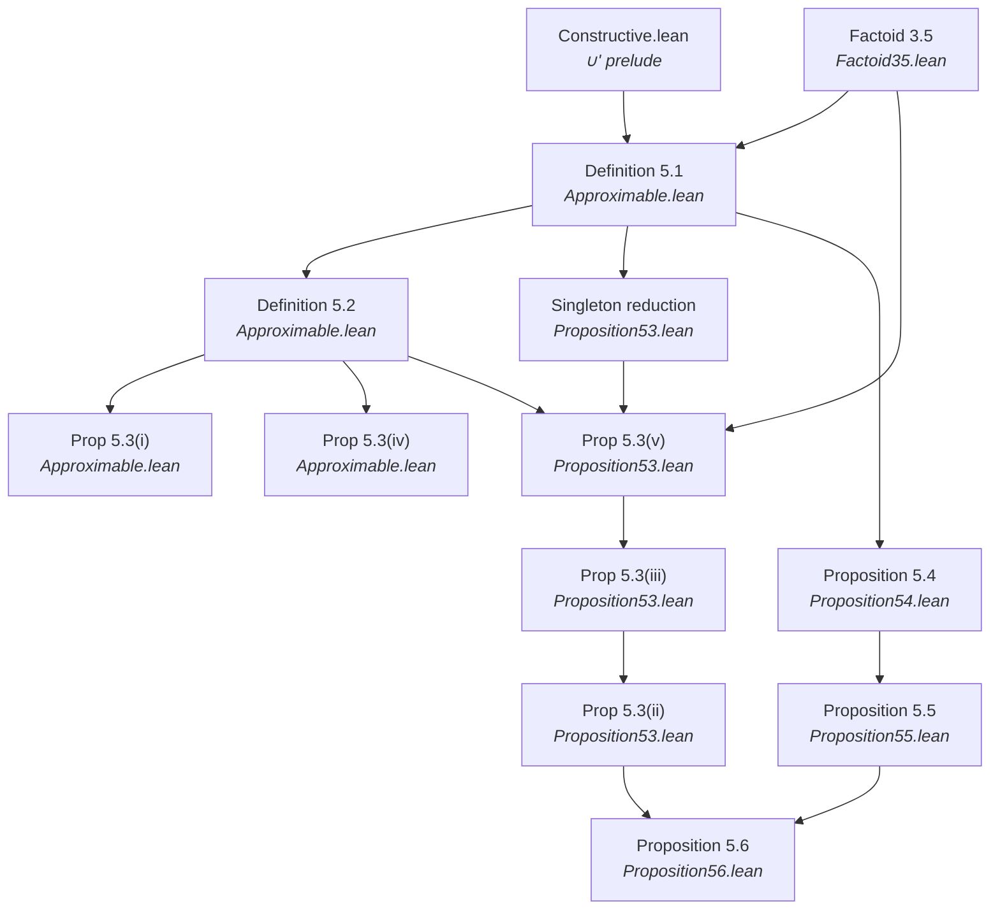
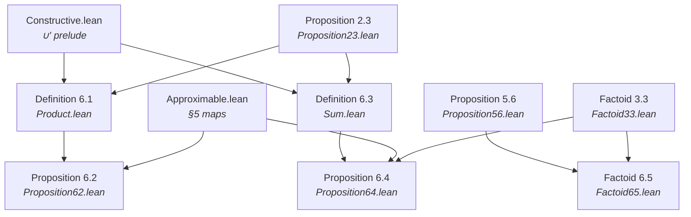
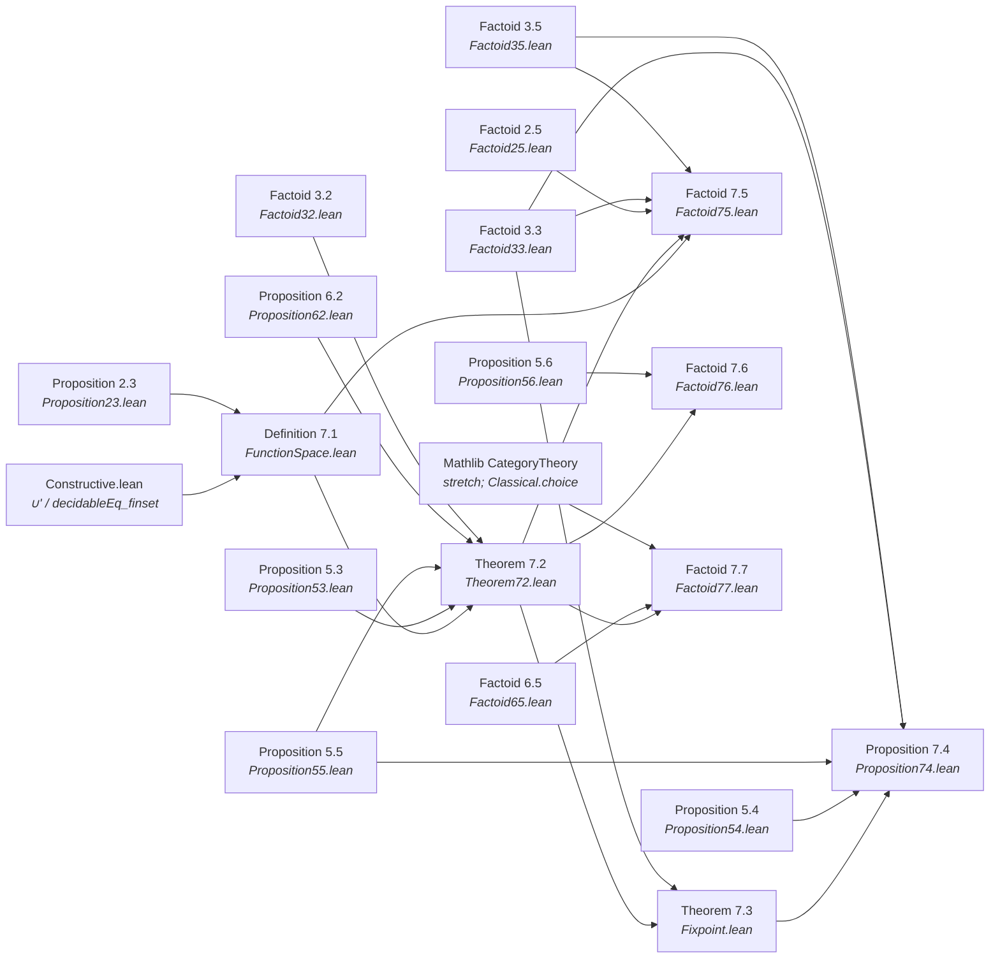
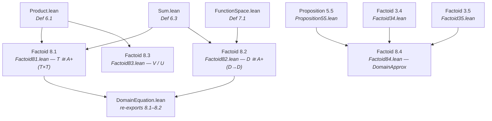

# Formalizing Dana Scott's 1982 Information Systems in Lean 4

---

## Abstract

In 1982 Dana Scott published *Domains for Denotational Semantics* (ICALP, LNCS 140),
presenting domains via **information systems**: finite consistency and entailment on data
objects (tokens), with domain elements recovered as consistent, deductively closed sets.
This is the third of Scott's major presentations of domain theory—after continuous lattices
**[Sco72]** and neighbourhood systems (PRG-19, **[Sco81]**) — and is the most explicitly
constructive of the three. Companion Lean formalizations of those earlier presentations are
[`scott1972`](https://github.com/catskillsresearch/scott1972) **[SR72]** and
[`scott1980`](https://github.com/catskillsresearch/scott1980) **[ER80]**.

This Lean 4 formalization targets the **entire paper** (Sections 1–8). We strive to avoid
the law of excluded middle. Every completed module is audited with `#print axioms`; the
target footprint is `#print axioms ⊆ {propext, Quot.sound}`. Choice-tainted mathlib `Finset`
operations are replaced by the prelude in `Scott1982/Constructive.lean`.

---

## Introduction

Scott's 1982 ICALP paper reorganizes domain theory around four simple ideas:

1. **Data objects** (tokens / propositions) with a distinguished least-informative object `Δ`.
2. **Consistency** (`Con`): which finite sets of tokens can hold of a single element.
3. **Entailment** (`⊢`): which tokens are forced by a consistent set.
4. **Elements** as consistent, deductively closed sets of tokens — the domain `|A|`.

From this substrate he builds approximable mappings (a category), products, separated sums,
function spaces (cartesian closed structure), least fixed points, and recursive domain
equations (trees / S-expressions, λ-calculus models, universal domains).

### Paper section dependency

Edges follow Scott's narrative dependencies. Lean import graphs for §§2–3 and §§5–8 are
stable (see per-section diagrams below); §4 Factoids 4.1–4.6 are mechanized
(the dashed §4→§5 edge remains advisory: later sections do not import §4).



### Lean module map

Named concepts get section-style modules; unnamed numbered results get `DefinitionXY` /
`PropositionXY` / `TheoremXY` files; invented claims use **Factoid** labels. Edges are
Lean imports (coarse: `Factoid3*` stands for the §3 family). §8 factoids are **independent**
constructions — they do not import each other; `DomainEquation.lean` only re-exports 8.1–8.2.



---

## Methodology

### Source material

Primary source: Dana Scott, *Domains for Denotational Semantics*, ICALP 1982, LNCS 140.
Working OCR: [`sources/Domains_for_Denotational_Semantics.md`](sources/Domains_for_Denotational_Semantics.md)
(`extraction_method: cursor-vision-triple-merge`).

### Numbering

* **Scott's numbers** are used wherever present (Def/Prop/Thm share one counter per section).
* **Invented claims** (informal remarks we elevate to formal statements) use **Factoid** labels
  continuing the section counter, e.g. after Def 3.1 the next invented item is Factoid 3.2.
* Factoids are first-class inventory rows with Lean files and proof notes.

### Constructivity

Target: `#print axioms ⊆ {propext, Quot.sound}`.
`Scott1982/Constructive.lean` supplies choice-free `funion` (`∪'`) and `insert_comm'`.
Avoid mathlib `(· ∪ ·)`, `Finset.image`, `tauto`, `aesop` unless audited.

### Portable prior work

Where Scott 1972 **[Sco72]** /
[`scott1972`](https://github.com/catskillsresearch/scott1972) **[SR72]** and PRG-19 **[Sco81]** /
[`scott1980`](https://github.com/catskillsresearch/scott1980) **[ER80]** developed the *same*
mathematics in a portable form, we **copy** the Lean into this repo (adapted to `InfoSys` /
`Finset` as needed) rather than depending on sibling packages. Cross-presentation equivalence
theorems remain in `scott_models`.

---

## Chronological Formalization Narrative

### §1 Introduction

Motivational prose only — no numbered mathematical claims. No Lean modules.


---

### §2 Information systems



Paper order: examples sit between Def 2.1 and Def 2.2; Lean matches that — each
`Factoid2*.lean` imports only `InfoSys`. Prop 2.3 also needs `Constructive` for `∪'`.

#### Definition 2.1
* **Mathematical Target:** Information system `(D, Δ, Con, ⊢)` with Scott's six axioms (i)–(vi).
* **Lean File:** `Scott1982/InfoSys.lean` (`structure InfoSys`)
* **Proof Notes:** structure fields `con_subset`, `con_sing`, `ent_con`, `ent_bot`,
  `ent_refl`, `ent_trans`. Uses `insert` (not mathlib `∪`) in `ent_con` for choice-freedom.
  Footprint target `{propext, Quot.sound}`.

#### Definition 2.2
* **Mathematical Target:** For `u, v ∈ Con`, write `u ⊢ v` to mean `u ⊢ X` for all `X ∈ v`.
* **Lean File:** `Scott1982/Definition22.lean`
* **Proof Notes:** `InfoSys.EntSet`.

#### Proposition 2.3
* **Mathematical Target:** For `u, v, w, u', v' ∈ Con`: (i) `∅ ⊢ {Δ}`; (ii) `u ⊢ v ⇒ u ∪ v ∈ Con`;
  (iii) `u ⊢ u`; (iv) transitivity; (v) monotonicity; (vi) `u ⊢ v ∧ u ⊢ v' ⇒ u ⊢ v ∪ v'`.
* **Lean File:** `Scott1982/Proposition23.lean`
* **Proof Notes:** uses `∪'` from `Constructive.lean` for (ii) and (vi).

#### Factoid 2.4
* **Mathematical Target:** First example: `D = ℕ`, `Δ = 0`, all finite sets consistent,
  `{nᵢ} ⊢ m` iff `m = 0 ∨ ∃ i, m ≤ nᵢ`.
* **Lean File:** `Scott1982/Factoid24.lean`
* **Proof Notes:** `example : InfoSys ℕ` with `lowerBoundEnt`; axioms (i)–(iii)
  trivial (`Con = univ`); (iv) `0`-bot; (v) reflexivity via `le_rfl`; (vi) cut by chaining
  `≤` through the witness in `u`. Imports only `InfoSys` (Def 2.1 apparatus). No `sorry`.

#### Factoid 2.5
* **Mathematical Target:** Second example: open intervals `(n, m)` with `n < m`, plus `(0, ∞)`.
* **Lean File:** `Scott1982/Factoid25.lean`
* **Proof Notes:** `Token = bot ⊕ strict intervals`; satisfaction on `ℚ`;
  `ofSatisfaction` builds any Scott-style semantic `InfoSys` from `Sat` + true `bot` +
  inhabited singletons. `Ent` pairs consistency of the LHS with `∀`-entailment (so `ent_con`
  is not vacuous). Midpoint witness for singletons. No `sorry`.

#### Factoid 2.6
* **Mathematical Target:** Third example: partial functions `A ⇀ B` as graphs plus `Δ`.
* **Lean File:** `Scott1982/Factoid26.lean`
* **Proof Notes:** `Token A B = bot ⊕ (A × B)`; `Consistent` = functional on pairs;
  minimal `Ent` (`X = Δ ∨ X ∈ u`) with LHS consistency; `partialFunctionSystem A B` plus
  `example` on `ℕ`/`Bool`. No `sorry`.

---

### §3 The elements of a system



Def 3.1 (`Element`) lives in `InfoSys.lean` with Def 2.1. Factoids 3.2/3.5 import
`Proposition23` (for `EntSet` / `∪'` lemmas); 3.3 builds on 3.2; 3.4 needs only `InfoSys`;
3.6 imports `Factoid35` and `Constructive` for directedness via `∪'`.

#### Definition 3.1
* **Mathematical Target:** Elements `|A|`: subsets `x ⊆ D` with (i) every finite subset in `Con`,
  (ii) closed under entailment. Total elements `Tot_A`.
* **Lean File:** `Scott1982/InfoSys.lean` (`InfoSys.Element`, `PartialOrder`)
* **Proof Notes:** `Element` / `PartialOrder`; `IsTotal` / top via Factoid 3.4.

#### Factoid 3.2
* **Mathematical Target:** Every element contains `Δ`.
* **Lean File:** `Scott1982/Factoid32.lean`

#### Factoid 3.3
* **Mathematical Target:** `⊥_A = {X ∣ {Δ} ⊢ X}` is the least element.
* **Lean File:** `Scott1982/Factoid33.lean`

#### Factoid 3.4
* **Mathematical Target:** Top `⊤ = D` exists iff all finite subsets are consistent; then unique total.
* **Lean File:** `Scott1982/Factoid34.lean`
* **Proof Notes:** `IsTotal` (maximal); `AllConsistent`; `topElement` with carrier `Set.univ`;
  `exists_top_iff_allConsistent`; uniqueness `eq_topElement_of_isTotal` /
  `exists_unique_total_of_allConsistent`. No `sorry`.

#### Factoid 3.5
* **Mathematical Target:** Closure `ū = {X ∣ u ⊢ X}` of `u ∈ Con` is an element (finite element).
* **Lean File:** `Scott1982/Factoid35.lean`

#### Factoid 3.6
* **Mathematical Target:** Every element is the directed union of its finite approximations:
  `x = ⋃{ū ∣ u ⊆ x, u ∈ Con}`.
* **Lean File:** `Scott1982/Factoid36.lean`
* **Proof Notes:** `approxUnion` / `element_eq_approxUnion` (via singleton witnesses and
  entailment closure); `closures_directed` using `∪'`; helpers `closure_le_of_entSet`,
  `closure_le_of_subset`, `closure_le_element`. No `sorry`.

---

### §4 Domains as lattices and as topological spaces

Scott keeps §4 informal (bridge to lattice/topology presentations). Elevated claims are
Factoids; Lean edges below match imports. Later sections (§5–§8) do not depend on these
modules.



#### Factoid 4.1
* **Mathematical Target:** `|A|` is an inf-semilattice under `∩`; `x ⊆ y ↔ x ∩ y = x`.
* **Lean File:** `Scott1982/Factoid41.lean`
* **Proof Notes:** `inf` via carrier `∩`; `inf_le_left`/`right`, `le_inf`, `le_iff_inf_eq`;
  idempotent/commutative/associative; `botElement_inf`. No `sorry`.

#### Factoid 4.2
* **Mathematical Target:** Nonempty families of elements have set-theoretic intersections that are elements.
* **Lean File:** `Scott1982/Factoid42.lean`
* **Proof Notes:** `familyInf` / `familyInf_le` / `le_familyInf`; agrees with binary `inf`
  via `familyInf_pair`. Axioms ⊆ `{propext, Quot.sound}`. No `sorry`.

#### Factoid 4.3
* **Mathematical Target:** Join of a family exists in `|A|` iff the union is consistent; then join = deductive closure of the union.
* **Lean File:** `Scott1982/Factoid43.lean`
* **Proof Notes:** `IsFinitelyConsistent` / `deductiveClosure` / `familySup` / binary `join`;
  `exists_isLUB_iff` / `exists_join_iff`. Axioms ⊆ `{propext, Quot.sound}`. No `sorry`.

#### Factoid 4.4
* **Mathematical Target:** Directed (in particular chain) unions of elements are elements (cpo).
* **Lean File:** `Scott1982/Factoid44.lean`
* **Proof Notes:** `IsDirected` / `IsChain`; `directedSup` with carrier = raw union;
  `chainSup`. Axioms ⊆ `{propext, Quot.sound}`. No `sorry`.

#### Factoid 4.5
* **Mathematical Target:** Finite elements `ū` are compact; every element is directed lub of finite elements below it (algebraicity).
* **Lean File:** `Scott1982/Factoid45.lean`
* **Proof Notes:** `finiteApproximants` directed; `eq_directedSup_finiteApproximants`;
  `compact_closure`. Axioms ⊆ `{propext, Quot.sound}`. No `sorry`.

#### Factoid 4.6
* **Mathematical Target:** Scott topology via basic opens `{x ∣ u ⊆ x}`; approximable maps = Scott-continuous maps.
* **Lean File:** `Scott1982/Factoid46.lean`
* **Proof Notes:** `basicOpen` / `basicOpen_inter` / `T₀`; `ScottContinuous`;
  `toScottContinuous` / `ofScottContinuous` / `toElement_ofScottContinuous`.
  Axioms ⊆ `{propext, Quot.sound}`. No `sorry`.

---

### §5 Approximable mappings between domains



`Approximable.lean` imports `Constructive` and `Factoid35`. Def 5.1–5.2 and 5.3(i)/(iv)
live there; singleton reduction and 5.3(v)/(iii)/(ii) are in `Proposition53.lean`. Prop 5.5
imports Prop 5.4; Prop 5.6 imports Prop 5.3 (extensionality) and Prop 5.5 (composition).

#### Definition 5.1
* **Mathematical Target:** Approximable mapping `f : A → B` as relation on `Con_A × Con_B` with
  (i) `∅ f ∅`; (ii) `u f v ∧ u f v' ⇒ u f (v ∪ v')`; (iii) `u' ⊢ u`, `u f v`, `v ⊢ v' ⇒ u' f v'`.
* **Lean File:** `Scott1982/Approximable.lean`
* **Proof Notes:** Structure. Adapted from PRG-19 `ApproximableMap` pattern, rewritten for `Finset`/`Con`.

#### Definition 5.2
* **Mathematical Target:** `f(x) = {Y ∣ ∃ u ⊆ x, u f {Y}}`.
* **Lean File:** `Scott1982/Approximable.lean`
* **Proof Notes:** `toElement`; `exists_rel_of_subset_image`.

#### Proposition 5.3(i)
* **Mathematical Target:** `f` maps elements to elements under Def 5.2 (`f(x) ∈ |B|`).
* **Lean File:** `Scott1982/Approximable.lean`
* **Proof Notes:** `toElement` (consistency + closure).

#### Proposition 5.3(ii)
* **Mathematical Target:** Extensionality: `f = g` iff `f(x) = g(x)` for all `x ∈ |A|`.
* **Lean File:** `Scott1982/Proposition53.lean`
* **Proof Notes:** `ext_iff_toElement` via 5.3(iii) both ways + `ApproximableMap.ext`.
  No `sorry`.

#### Proposition 5.3(iii)
* **Mathematical Target:** Pointwise order: `f ⊆ g` (as relations) iff `f(x) ⊆ g(x)` for all `x ∈ |A|`.
* **Lean File:** `Scott1982/Proposition53.lean`
* **Proof Notes:** `Le` / `le_iff_toElement_le`; ← uses 5.3(v). No `sorry`.

#### Proposition 5.3(iv)
* **Mathematical Target:** Monotonicity: `x ⊆ y` in `|A|` implies `f(x) ⊆ f(y)` in `|B|`.
* **Lean File:** `Scott1982/Approximable.lean`
* **Proof Notes:** `toElement_mono`.

#### Singleton reduction
* **Mathematical Target:** Scott’s remark before Def 5.2: `u f v ↔ ∀ Y ∈ v, u f {Y}`
  (for `u ∈ Con_A`, `v ∈ Con_B`).
* **Lean File:** `Scott1982/Proposition53.lean`
* **Proof Notes:** `rel_iff_forall_singleton` (`mono` + `union_right` / `∪'`).
  Unnumbered inventory row. No `sorry`.

#### Proposition 5.3(v)
* **Mathematical Target:** Bridge lemma: `u f v ↔ v̄ ⊆ f(ū)` for `u ∈ Con_A`, `v ∈ Con_B`.
* **Lean File:** `Scott1982/Proposition53.lean`
* **Proof Notes:** `rel_iff_closure_le`; → via `subset_closure` + `mono`; ← via
  `exists_rel_of_subset_image` on `ū` then `EntSet u u'` + `mono`. No `sorry`.

#### Proposition 5.4
* **Mathematical Target:** Identity `I_A` given by `u I v ↔ u ⊢ v`; `I(x) = x`.
* **Lean File:** `Scott1982/Proposition54.lean`

#### Proposition 5.5
* **Mathematical Target:** Composition `g ∘ f`; `(g ∘ f)(x) = g(f(x))`.
* **Lean File:** `Scott1982/Proposition55.lean`

#### Proposition 5.6
* **Mathematical Target:** Unique constant map `const b` with `(const b)(x) = b`;
  also `f ∘ (const b) = const (f(b))` and `(const b) ∘ g = const b`.
* **Lean File:** `Scott1982/Proposition56.lean`
* **Proof Notes:** `constMap` via `u (const b) v ↔ ↑v ⊆ b`; `constMap_toElement`;
  uniqueness via `ext_iff_toElement`; composition laws via `comp_toElement`. No `sorry`.

---

### §6 Products and sums of domains



`Product.lean` (Def 6.1 / `productSystem`) imports `Constructive` and `Proposition23`.
`Proposition62.lean` adds approximable `fst`/`snd`/`⟨f,g⟩` on top of `Product` /
Prop 5.3–5.5. `Sum.lean` (Def 6.3 / `sumSystem`) is parallel to `Product.lean`;
`Proposition64.lean` adds `inl`/`inr`/`[f,g]` (also Factoid 3.3 for `⊥` on copairing).
`Factoid65.lean` (unit domain) imports Prop 5.6 (`constMap`) and Factoid 3.3 (`⊥`);
Scott places it after the product remarks, before the sum construction.

#### Definition 6.1
* **Mathematical Target:** Product information system `A × B` on tagged tokens.
* **Lean File:** `Scott1982/Product.lean`
* **Proof Notes:** `ProdToken` / `IsProdToken`; `prodBot`; `fstFinset` / `sndFinset`;
  `ProdCon` / `ProdEnt`; `productSystem : InfoSys _` with all six Def 2.1 axioms. No `sorry`.

#### Proposition 6.2
* **Mathematical Target:** Approximable `fst`, `snd`, pairing `⟨f,g⟩` with universal property
  (`A × B` as an `InfoSys` is already Def 6.1 / `productSystem`).
* **Lean File:** `Scott1982/Proposition62.lean`
* **Proof Notes:** `fstMap` / `sndMap` / `pairMap`; `comp_fstMap_pairMap` /
  `comp_sndMap_pairMap`; uniqueness via `element_eq_of_fst_snd` + Prop 5.3 extensionality.
  Axioms ⊆ `{propext, Quot.sound}`. No `sorry`.

#### Definition 6.3
* **Mathematical Target:** Separated sum `A + B`.
* **Lean File:** `Scott1982/Sum.lean`
* **Proof Notes:** `SumToken` (`left` / `right` / `bot`); `sumBot`; `lftFinset` /
  `rhtFinset`; `SumCon` / `SumEnt`; `sumSystem : InfoSys _` with all six Def 2.1 axioms.
  Axioms ⊆ `{propext, Quot.sound}`. No `sorry`.

#### Proposition 6.4
* **Mathematical Target:** Sum is an information system; injections and copairing.
* **Lean File:** `Scott1982/Proposition64.lean`
* **Proof Notes:** `inlMap` / `inrMap` / `copairMap`; `comp_copairMap_inlMap` /
  `comp_copairMap_inrMap`; `copairMap_botElement`; uniqueness via relation extensionality
  (choice-free `lft`/`rht` emptiness dichotomy). Axioms ⊆ `{propext, Quot.sound}`. No `sorry`.

#### Factoid 6.5
* **Mathematical Target:** Unit domain `1` with unique element `⊥`; terminal/initial mapping facts Scott records at end of §6.
* **Lean File:** `Scott1982/Factoid65.lean`
* **Proof Notes:** `unitSystem` on `PUnit`; `unitElement_eq_bot`;
  `approxMap_from_unit_eq_const` / `approxMap_to_unit_eq_const`;
  `toElement_constMap_bot`. Axioms ⊆ `{propext, Quot.sound}`. No `sorry`.

---

### §7 The function space as a domain



`FunctionSpace.lean` (Def 7.1) imports `Constructive` and `Proposition23` only.
Theorem 7.2 adds Prop 5.3/5.5, Prop 6.2 (`apply`/`curry` pairing), and Factoid 3.2.
Theorem 7.3 (`fix`) sits on Theorem 7.2 plus Factoid 3.3 (`⊥`); Prop 7.4 adds
identity/composition and closure. Factoid 7.5 reuses Factoid 2.5 (`BOOL`) for the
conditional iso. Factoid 7.6 curries Prop 5.6/`pair` composites. Factoid 7.7 packages
the CCC as Mathlib `Category` / `CartesianMonoidalCategory` / `MonoidalClosed`
(Scott data constructive; Mathlib packaging uses `Classical.choice`).

#### Definition 7.1
* **Mathematical Target:** Function-space information system `A → B` with Scott's `Con`/`⊢` on pairs of consistent sets.
* **Lean File:** `Scott1982/FunctionSpace.lean`
* **Proof Notes:** `FunToken` / `funBot`; `funInputUnion` / `funOutputUnion`;
  `FunCon` / `FunEnt` (witness form of 7.1(iv)); `functionSystem : InfoSys _` with all six
  Def 2.1 axioms. Choice-free `decidableEq_finset` for token equality. Axioms ⊆
  `{propext, Quot.sound}`. No `sorry`.

#### Theorem 7.2
* **Mathematical Target:** Elements of `|A → B|` = approximable maps; `apply` and `curry`.
* **Lean File:** `Scott1982/Theorem72.lean`
* **Proof Notes:** bijection `approxMap_toElement` / `element_toApproxMap`;
  approximable `applyMap` and `curryMap`; `apply(g,y) = g(y)`;
  `uncurry ∘ curry = id` with uniqueness of `curry`. Axioms ⊆ `{propext, Quot.sound}`.
  No `sorry`.

#### Theorem 7.3
* **Mathematical Target:** Least fixed-point operator `fix : (A → A) → A`.
* **Lean File:** `Scott1982/Fixpoint.lean`
* **Proof Notes:** `FixChain` / `FixReach`; approximable `fixMap`;
  `fixElement` with `f(fix f) = fix f`, least among pre-fixed points, and operator
  uniqueness. Axioms ⊆ `{propext, Quot.sound}`. No `sorry`.

#### Proposition 7.4
* **Mathematical Target:** Plotkin-style equational characterization of `fix`.
* **Lean File:** `Scott1982/Proposition74.lean`
* **Proof Notes:** (ii) `fix(f) = f(fix(f))`; (iii) naturality for strict
  commuting maps; uniqueness via the Theorem 7.3 least-fixed-point property.
  Axioms ⊆ `{propext, Quot.sound}`. No `sorry`.

#### Factoid 7.5
* **Mathematical Target:** Strict function space `A →ₛ B` and `strict` operator; `A × A ≅ (BOOL →ₛ A)`.
* **Lean File:** `Scott1982/Factoid75.lean`
* **Proof Notes:** `IsStrict`; `strictify` with `IsStrict_strictify`;
  `strictFunctionSystem` (`StrictFunToken` + empty-input Con clause); retract via
  `approxMap_toStrictElement` / `strictifyElement`; flat `boolSystem`; conditional
  `condMap` with `condMap_unique` / `conditional_iso` (`A × A ≅ (BOOL →ₛ A)` at the
  strict-map level, packaged into `|BOOL →ₛ A|` by `condElement`).
  Axioms ⊆ `{propext, Quot.sound}`. No `sorry`.

#### Factoid 7.6
* **Mathematical Target:** Combinators `const`, `pair`, `comp` as approximable operators.
* **Lean File:** `Scott1982/Factoid76.lean`
* **Proof Notes:** `constOp = curry fst` with `constOp_toElement`;
  `pairOp` / `compOp` by currying `apply`–`fst`/`snd` composites;
  `pairOp_toElement` / `compOp_toElement` recover `⟨f,g⟩` and `g ∘ f`.
  Axioms ⊆ `{propext, Quot.sound}`. No `sorry`.

#### Factoid 7.7
* **Mathematical Target:** Scott’s CCC remark (*Categories again*): Props 6.2 and Theorem 7.2
  (with unit `1` from Factoid 6.5) show the category of information systems and approximable
  maps is cartesian closed.
* **Lean File:** `Scott1982/Factoid77.lean`
* **Proof Notes:** bundled `InfoSysObj`; Mathlib `Category`,
  `CartesianMonoidalCategory` (terminal `1`, binary products from Prop 6.2), and
  `MonoidalClosed` via `tensorExpEquiv` / `uncurryRight_comp_left` (Scott curry after
  product symmetry, left-natural in the domain). Bare `Category` axioms ⊆
  `{propext, Quot.sound}`; `CartesianMonoidalCategory` / `MonoidalClosed` pull
  `Classical.choice` through Mathlib’s chosen-products / adjunction constructors — an
  artifact of Lean’s category library, isolated to this stretch factoid, not of Scott’s
  argument. No `sorry`.

---

### §8 Some domain equations

Scott presents Factoids 8.1–8.4 in narrative order, but the Lean modules are **independent**
constructions (no `Factoid8i → Factoid8(i+1)` imports). Edges below are actual Lean imports.
`DomainEquation.lean` only re-exports 8.1–8.2.



#### Factoid 8.1
* **Mathematical Target:** Inductive construction of tree / S-expression domain `T ≅ A + (T × T)`.
* **Lean File:** `Scott1982/Factoid81.lean`
* **Proof Notes:** inductive `TreeToken` (Scott (1)–(3)); projection-based
  `TreeCon` / `TreeEnt` matching sum×product clauses (4)–(12); `treeSystem : InfoSys _`
  with all six Def 2.1 axioms; unfolding `treeUnfold` / `treeRhs` into
  `sumSystem A (productSystem (treeSystem A) (treeSystem A))`. Axioms ⊆
  `{propext, Quot.sound}`. No `sorry`.

#### Factoid 8.2
* **Mathematical Target:** λ-calculus model `D ≅ A + (D → D)` via mutual recursion of `D` and `Con`.
* **Lean File:** `Scott1982/Factoid82.lean`
* **Proof Notes:** choice-free well-founded **`LamConDepth`** / inductive
  **`LamEntDepth`** (Scott (8)–(11)); Def 2.1 `ent_refl` / `ent_con` /
  **`ent_trans`** (bot/atom + funTok via combined witness + depth IH);
  `lambdaSystem : InfoSys (LamDToken A)` on depth-WF tokens; unfolding
  `lamUnfold` / `lamRhs` into `sumSystem A (functionSystem (lambdaSystem A)
  (lambdaSystem A))`. Staged `LamConN` retained as scaffolding. Axioms ⊆
  `{propext, Quot.sound}`. No `sorry`.

#### Factoid 8.3
* **Mathematical Target:** Universal domain remarks (`V`, retract `U`).
* **Lean File:** `Scott1982/Factoid83.lean`
* **Proof Notes:** `VToken` (Scott (1)–(2): `Δ`/`∇`/`pairL`/`pairR`);
  all finite sets consistent; inductive **`VEnt`** (3)–(6); `vSystem : InfoSys VToken`;
  `vUnfold` / `vRhs` into `productSystem vSystem vSystem` (`V ≅ V × V`);
  `UToken = D_V \ {∇}` with **`UCon`** = `⊬_V ∇` and **`UEnt`** from `VEnt`
  (7)–(10); `uSystem : InfoSys UToken`. Scott’s retract/universality theorem
  (every countably based domain is a retract of `U`) is stated without proof in
  the source and left external. Axioms ⊆ `{propext, Quot.sound}`. No `sorry`.

#### Factoid 8.4
* **Mathematical Target:** Domain of domains via approximable maps on `P` satisfying (1)–(5).
* **Lean File:** `Scott1982/Factoid84.lean`
* **Proof Notes:** (Scott’s sketch, as far as stated) — powerset InfoSys
  **`P`** on `ℕ` (`0 = Δ`, all finite sets Con, minimal Ent); Scott’s (1)–(5) as
  `ReflApprox` / `IdemApprox` / `BotApprox` / `RogueApprox` / `ConsistentApprox` on
  `ApproximableMap P P`; package **`DomainApprox`**; consistency remark
  `scottCon`; inhabitant `flatDomainApprox` (`1` as rogue); `I_P` fails (4).
  Token-level InfoSys for the domain of domains (U-from-V style on `P → P`) and
  functors/powerdomains are deferred with Scott. Axioms ⊆ `{propext, Quot.sound}`.
  No `sorry`.

---

## Build

```bash
lake exe cache get
lake build Scott1982
```

Pinned: Lean / mathlib **v4.30.0**.

Acknowledgments (Dana Scott **[Sco82]**, AI tool cards, artifact URL) are injected before
References when building `arxiv.tex` via `scripts/ai_model_cards.py` — they are not kept in
this file.

Rebuild this document (PDF with complete Lean source appendix, one subsection per
module):

```bash
bash scripts/build_arxiv_pdf.sh            # expand Lean → tex → arxiv.pdf
bash scripts/build_arxiv_pdf.sh --pdf-only # PDF only when arxiv.tex already current
```

---

## References

- **[Sco82]** D. Scott. *Domains for Denotational Semantics*. ICALP 1982, LNCS 140, pp. 577–613.
- **[Sco81]** D. Scott. *Lectures on a Mathematical Theory of Computation*. PRG-19, Oxford, 1981.
- **[Sco72]** D. Scott. *Continuous Lattices*. LNM 274, 1972.
- **[SR72]** Catskills Research. *scott1972*. <https://github.com/catskillsresearch/scott1972>.
- **[ER80]** Catskills Research. *scott1980*. <https://github.com/catskillsresearch/scott1980>.
- **[Win93]** G. Winskel. *The Formal Semantics of Programming Languages*. MIT Press, 1993.
- **[COPE24]** Committee on Publication Ethics (COPE). *Authorship and AI tools: COPE position statement*. 2024. <https://publicationethics.org/guidance/cope-position/authorship-and-ai-tools>
<!-- AI_MODEL_REFERENCES -->
<!-- /AI_MODEL_REFERENCES -->

---

## Lean Code

All Lean 4 modules in the [scott1982](https://github.com/catskillsresearch/scott1982)
repository, listed for GitHub browsing. In the PDF build this index is replaced by the
verbatim Lean source (complete appendix, one subsection per module). Order matches
[`Scott1982.lean`](https://github.com/catskillsresearch/scott1982/blob/main/Scott1982.lean).

### Root

* [Scott1982.lean](https://github.com/catskillsresearch/scott1982/blob/main/Scott1982.lean)

### Library (import order)

* [Constructive.lean](https://github.com/catskillsresearch/scott1982/blob/main/Scott1982/Constructive.lean)
* [InfoSys.lean](https://github.com/catskillsresearch/scott1982/blob/main/Scott1982/InfoSys.lean)
* [Definition22.lean](https://github.com/catskillsresearch/scott1982/blob/main/Scott1982/Definition22.lean)
* [Proposition23.lean](https://github.com/catskillsresearch/scott1982/blob/main/Scott1982/Proposition23.lean)
* [Factoid24.lean](https://github.com/catskillsresearch/scott1982/blob/main/Scott1982/Factoid24.lean)
* [Factoid25.lean](https://github.com/catskillsresearch/scott1982/blob/main/Scott1982/Factoid25.lean)
* [Factoid26.lean](https://github.com/catskillsresearch/scott1982/blob/main/Scott1982/Factoid26.lean)
* [Factoid32.lean](https://github.com/catskillsresearch/scott1982/blob/main/Scott1982/Factoid32.lean)
* [Factoid33.lean](https://github.com/catskillsresearch/scott1982/blob/main/Scott1982/Factoid33.lean)
* [Factoid34.lean](https://github.com/catskillsresearch/scott1982/blob/main/Scott1982/Factoid34.lean)
* [Factoid35.lean](https://github.com/catskillsresearch/scott1982/blob/main/Scott1982/Factoid35.lean)
* [Factoid36.lean](https://github.com/catskillsresearch/scott1982/blob/main/Scott1982/Factoid36.lean)
* [Factoid41.lean](https://github.com/catskillsresearch/scott1982/blob/main/Scott1982/Factoid41.lean)
* [Factoid42.lean](https://github.com/catskillsresearch/scott1982/blob/main/Scott1982/Factoid42.lean)
* [Factoid43.lean](https://github.com/catskillsresearch/scott1982/blob/main/Scott1982/Factoid43.lean)
* [Factoid44.lean](https://github.com/catskillsresearch/scott1982/blob/main/Scott1982/Factoid44.lean)
* [Factoid45.lean](https://github.com/catskillsresearch/scott1982/blob/main/Scott1982/Factoid45.lean)
* [Factoid46.lean](https://github.com/catskillsresearch/scott1982/blob/main/Scott1982/Factoid46.lean)
* [Approximable.lean](https://github.com/catskillsresearch/scott1982/blob/main/Scott1982/Approximable.lean)
* [Proposition53.lean](https://github.com/catskillsresearch/scott1982/blob/main/Scott1982/Proposition53.lean)
* [Proposition54.lean](https://github.com/catskillsresearch/scott1982/blob/main/Scott1982/Proposition54.lean)
* [Proposition55.lean](https://github.com/catskillsresearch/scott1982/blob/main/Scott1982/Proposition55.lean)
* [Proposition56.lean](https://github.com/catskillsresearch/scott1982/blob/main/Scott1982/Proposition56.lean)
* [Product.lean](https://github.com/catskillsresearch/scott1982/blob/main/Scott1982/Product.lean)
* [Proposition62.lean](https://github.com/catskillsresearch/scott1982/blob/main/Scott1982/Proposition62.lean)
* [Sum.lean](https://github.com/catskillsresearch/scott1982/blob/main/Scott1982/Sum.lean)
* [Proposition64.lean](https://github.com/catskillsresearch/scott1982/blob/main/Scott1982/Proposition64.lean)
* [Factoid65.lean](https://github.com/catskillsresearch/scott1982/blob/main/Scott1982/Factoid65.lean)
* [FunctionSpace.lean](https://github.com/catskillsresearch/scott1982/blob/main/Scott1982/FunctionSpace.lean)
* [Theorem72.lean](https://github.com/catskillsresearch/scott1982/blob/main/Scott1982/Theorem72.lean)
* [Fixpoint.lean](https://github.com/catskillsresearch/scott1982/blob/main/Scott1982/Fixpoint.lean)
* [Proposition74.lean](https://github.com/catskillsresearch/scott1982/blob/main/Scott1982/Proposition74.lean)
* [Factoid75.lean](https://github.com/catskillsresearch/scott1982/blob/main/Scott1982/Factoid75.lean)
* [Factoid76.lean](https://github.com/catskillsresearch/scott1982/blob/main/Scott1982/Factoid76.lean)
* [Factoid77.lean](https://github.com/catskillsresearch/scott1982/blob/main/Scott1982/Factoid77.lean)
* [Factoid81.lean](https://github.com/catskillsresearch/scott1982/blob/main/Scott1982/Factoid81.lean)
* [Factoid82.lean](https://github.com/catskillsresearch/scott1982/blob/main/Scott1982/Factoid82.lean)
* [Factoid83.lean](https://github.com/catskillsresearch/scott1982/blob/main/Scott1982/Factoid83.lean)
* [Factoid84.lean](https://github.com/catskillsresearch/scott1982/blob/main/Scott1982/Factoid84.lean)
* [DomainEquation.lean](https://github.com/catskillsresearch/scott1982/blob/main/Scott1982/DomainEquation.lean)

Vision transcript: [`sources/Domains_for_Denotational_Semantics.md`](https://github.com/catskillsresearch/scott1982/blob/main/sources/Domains_for_Denotational_Semantics.md).
